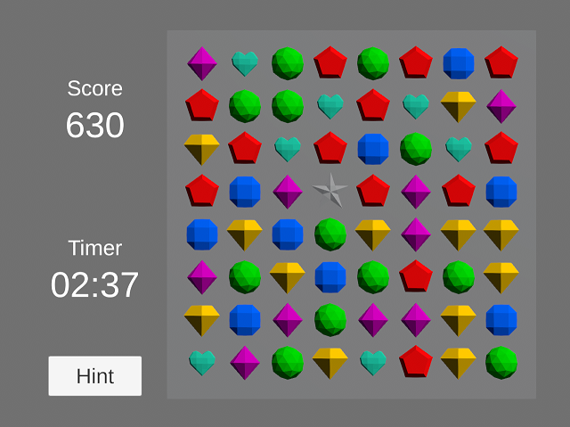

# Bejeweled

## Introduction

This is a naive prototype of Bejeweled with a simplifed ruleset and
a very simple user interface finished within two weekends.

In this game, you can swap two gems that are next to each other to
get a pair of 3 gems or more either horizontally or vertically.
You need to achieve the highest possible score within 3 minutes.

Getting a pair more than 3 gems, getting more pairs simulatenously,
and getting combos will have high scores. Additionally, if you get
a pair with 5 gems, or if you get a L or T style pair (with two pairs
sharing one gem), you will get a magic gem that can match with any gem!

## Engine

Unity 2019.2.9f1

## Credit

Art assets are from the following sources:
- [Simple Gems Ultimate Animated Customizable Pack](https://assetstore.unity.com/packages/3d/props/simple-gems-ultimate-animated-customizable-pack-73764)

## License

MIT License (Except for the art assets under their original licenses)
